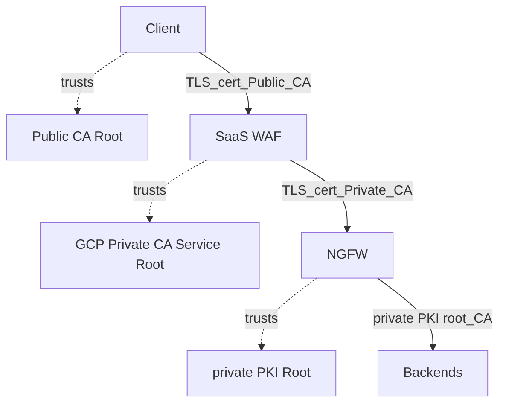
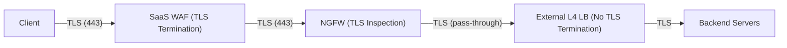

Secure Ingress Architecture without Mutual TLS (mTLS)
=====================================================

Executive Summary
-----------------

This document outlines a **secure ingress flow** for an enterprise web application that provides end-to-end encryption and multi-layer security inspection **without using mutual TLS (mTLS)** between internal components. In this architecture, a **SaaS Web Application Firewall (WAF)** and a **Next-Generation Firewall (NGFW)** work in tandem to inspect incoming traffic while maintaining TLS encryption on all public-facing segments. The design “bridges” TLS connections at each hop: the client’s TLS session terminates at the WAF, and a new TLS session initiates from the WAF to the NGFW. This approach allows the WAF and NGFW to decrypt and inspect traffic in a controlled manner, then re-encrypt it for the next leg, ensuring that data remains protected in transit. Importantly, the solution achieves strong security **without the complexity of mTLS** on any segment, simplifying certificate management and performance overhead.

**Key Highlights:**

*   **Defense-in-Depth:** The client’s connection is first handled by a cloud-based WAF service, which terminates the incoming TLS (HTTPS) connection using a certificate trusted by public CAs. The WAF inspects and filters malicious traffic at the application layer. It then initiates a new TLS connection to the downstream NGFW, effectively acting as a client to the NGFW. The NGFW, in turn, performs deep packet inspection on the decrypted traffic, adding another layer of security (intrusion detection, policy enforcement) before allowing it to reach backend servers.
    
*   **End-to-End Encryption (TLS at Each Leg):** TLS is **re-established at each leg** of the journey. The WAF terminates the client’s TLS session and then immediately creates a **new TLS session to the NGFW**. This means data is encrypted from the client to the WAF, and again from the WAF to the NGFW. Although the NGFW is decrypting traffic for inspection, traffic beyond the NGFW can be forwarded within a secure network either as plaintext (if deemed safe internally) or re-encrypted — in both cases, no sensitive data is exposed to any untrusted network. The clients on the internet **only see the WAF’s public certificate** and never see any internal certificates or the presence of the NGFW; to them, the connection appears as a normal TLS session to the known service.
    
*   **Robust Chain of Trust without mTLS:** Instead of using mutual TLS between WAF, NGFW, or backend, this design leverages a **certificate chain-of-trust model**. The SaaS WAF uses a certificate signed by a **public CA** (so all clients trust it by default), and the NGFW presents a certificate signed by a **private internal CA** (so the WAF trusts it because it has the private CA’s root certificate installed). By configuring trust this way, each device can authenticate the next device’s identity via standard TLS rules, without needing client certificates on either side. This eliminates operational complexity (no mutual certificate exchange to configure), while still ensuring that only authorized devices (holding the trusted CA-signed certs) can participate in the secure communication. The private CA is implemented via a managed **Certificate Authority Service** (CA pool) with no issuance constraints – meaning it can issue certificates for any domain as needed. This flexibility is crucial for the NGFW to dynamically generate certificates for whatever hostnames are in use. The WAF’s trust in this CA is what allows the TLS handshake with the NGFW to succeed seamlessly.
    
*   **Simplified Backend Connectivity:** After inspection, the NGFW forwards traffic to the backend application servers through a layer-4 load balancer operating in pass-through mode. This load balancer does not terminate TLS; it simply routes the packets to the appropriate backend instance. Because the critical inspection and authentication have already occurred, the connection from NGFW to backend does **not require mutual TLS**. The backend will receive traffic either over an encrypted channel (if one-way TLS is used) or as plaintext within the secured network, depending on configuration. In either case, eliminating mTLS on this leg reduces overhead on the servers while relying on upstream components to have vetted the connection. The overall architecture thus maintains security best practices (encryption and verification on external interfaces) and reduces internal complexity.
    
*   **Operational Excellence and DR:** This approach is cloud-friendly and aligns with enterprise operational needs. The use of a SaaS WAF means global scale, DDoS protection, and potential multi-region failover are handled by the WAF provider’s infrastructure. There are **no regional disaster recovery constraints** within this flow – any regional failover or traffic rerouting is managed upstream by the SaaS WAF or global load balancing layer. The focus of this design is the **security chain in a single region**. It can be replicated in multiple regions as needed, with the upstream WAF handling intelligent routing. From an executive perspective, the architecture provides a clear separation of concerns: the WAF secures the edge and scrubs traffic at the application layer, the NGFW secures the internal boundary with deep inspection, and the backends are shielded from direct exposure – all while keeping the data encrypted in transit and avoiding the complexity of mutual authentication protocols. This results in a secure yet efficient ingress pipeline suitable for high-volume, sensitive applications.
    

Chain of Trust Explanation
--------------------------

In this architecture, each TLS connection is anchored to a trusted Certificate Authority, creating a **chain of trust** that assures the identity of each party without requiring mutual certificate exchange. The following points detail how trust is established and maintained on each leg of the connection:

*   **Client → SaaS WAF (Public TLS Leg):** The client (for example, a user’s web browser or mobile app) initiates a TLS handshake to connect to the SaaS WAF’s endpoint. The WAF presents its server certificate to the client during the handshake. **This certificate is issued by a public Certificate Authority (CA)** that the client trusts (since public CAs are in the client system’s trust store by default). The client verifies the WAF’s certificate against the public CA’s root certificate. Once verified, a secure TLS session is established between the client and WAF. _From the client’s perspective, it is simply talking to the web application over HTTPS, unaware that the WAF is an intermediary._ The chain of trust here is the standard one: **\[Public CA\] → \[WAF’s Certificate\] → \[Client\].** The client trusts the WAF because a known and trusted Public CA vouches for it.
    
*   **SaaS WAF → NGFW (Private TLS Leg):** After terminating and inspecting the client’s traffic, the WAF needs to forward this traffic securely to the internal NGFW. To do so, the WAF acts as a TLS client and initiates a new TLS handshake with the NGFW (which behaves as an origin server from the WAF’s point of view). The **NGFW presents a certificate** during this handshake, just like any TLS server would. However, this certificate is **not signed by a public CA**; instead, the NGFW dynamically generates an **on-the-fly leaf certificate** for the target application’s host name and signs it using an **internal Private CA** (provided by a cloud Certificate Authority Service). For the WAF to accept this certificate, the **WAF must trust the Private CA’s root certificate**. Indeed, as part of the deployment, the Private CA’s root (or intermediate) certificate is installed in the WAF’s trust store. Because of this, when the NGFW presents a certificate for, say, yourapp.com signed by the internal CA, the WAF recognizes the signing CA as trusted and thus accepts the certificate as valid. This completes the second TLS handshake: a secure session between WAF and NGFW is now established. The chain of trust for this leg is **\[Private CA\] → \[NGFW’s dynamic certificate\] → \[WAF\]**. In essence, the Private CA vouches for the NGFW’s identity (dynamically for each request hostname), and the WAF, having been configured to trust that CA, accepts the NGFW’s identity. This mechanism obviates the need for mutual TLS (no client certificate from WAF is needed) because the **identity verification is handled by the CA-signed certificate**. It’s worth noting that the **private CA has no issuance constraints** – it is permitted to issue certificates for any domain needed. This is critical since the NGFW may need to impersonate any backend service domain during inspection. The CA service’s unconstrained issuance policy ensures the NGFW can dynamically create certificates for any hostname that the WAF might request, without failing trust checks. All of this happens behind the scenes: the client never sees this leg or the NGFW’s certificate. To the client, the WAF’s connection to the NGFW is invisible; it just knows that its data arrived securely at the service.
    
*   Regardless of which option is chosen, **mutual authentication is not used on this NGFW-to-backend leg** – there is no need for the backend to authenticate the NGFW via client certificate. The backend implicitly trusts traffic coming through the NGFW and load balancer because only legitimate, inspected traffic can reach that point. In summary, the chain of trust for the final segment is simplified: if TLS is used, it’s **\[Backend’s CA\] → \[Backend’s Certificate\] → \[NGFW\]** (one-way server authentication), and if TLS is not used, trust is enforced by network topology (NGFW’s presence in the path ensures only authorized traffic enters the backend subnet). This design choice streamlines backend operations by not requiring each server to manage client certs or perform mutual TLS handshakes, which aligns with the goal of avoiding mTLS while still keeping the system secure.
    
    *   **TLS (one-way) to Backend:** The NGFW can initiate a TLS connection to the backend server. In this case, the backend server would present its own TLS certificate (which could be issued by the same Private CA or another internal CA, or even a public CA if the domain is publicly certified). The NGFW, acting as a client here, would need to trust the issuer of the backend’s certificate (e.g., if it’s the same private CA, the NGFW trust store would include that CA as well, or it could trust public CAs if the backend uses a public cert). This still is **not mutual TLS** because the backend is not verifying a client certificate from the NGFW; it’s standard one-way TLS where only the server (backend) is authenticated. This option maintains encryption all the way to the server, which might be desirable if the traffic goes through any shared or external infrastructure (such as the external L4 load balancer) to reach the server.
        
    *   **Plain TCP (no TLS) to Backend:** Alternatively, if the environment is such that the NGFW and backend servers are within the same secure network enclave (for instance, within a private VPC or data center segment) and the organization is comfortable that the NGFW has fully vetted the traffic, the NGFW can forward the traffic as plaintext over TCP. The External L4 Load Balancer in this case is simply forwarding the TCP packets and is not performing any decryption. This might be chosen to reduce latency and CPU overhead on the backend servers (since they don’t have to terminate TLS again). Even though this means the final leg isn’t encrypted, it remains within controlled infrastructure (and often within a single cloud region or VPC). **No sensitive data is exposed to the public** because the only plaintext transmission is occurring in a protected internal network path. Many enterprises consider this acceptable once traffic is inside the trusted boundary, especially given that the heavy inspections have already occurred at the NGFW.
        

The diagram below illustrates the chain of trust between the components and how each entity trusts the next via the appropriate certificate authority:

_Diagram: Chain of Trust._ **Clients trust the SaaS WAF’s certificate** because it is signed by a **Public CA** that is in their trust stores. The **WAF trusts the NGFW’s certificate** because it is issued by a **Private CA** whose root certificate is installed on the WAF. No mutual TLS is in place; trust is established through these one-way certificate validations at each hop.

Traffic Flow Explanation
------------------------

The secure traffic flow can be described step-by-step, showing how a request from a client travels through the system and how each component handles it. The flow emphasizes where TLS is terminated and re-established, and how traffic moves without mutual TLS requirements:

1.  **Client → SaaS WAF:** A client (e.g. a user’s web browser) initiates an HTTPS request to the application’s URL. DNS for the application is configured to point to the SaaS WAF’s endpoint. The client connects to the **SaaS WAF** and performs a TLS handshake. The WAF presents its public certificate (signed by a well-known CA), which the client verifies and trusts. An encrypted TLS session is now established between the client and the WAF. The client then sends its HTTP request (inside this TLS tunnel) to the WAF. The SaaS WAF decrypts the request and inspects the content – applying WAF rules to filter out SQL injections, XSS, bad user-agents, etc., and possibly checking an allowlist/denylist of IPs or other application-layer defenses. This step **terminates the original TLS connection** from the client at the WAF.
    
2.  **WAF → NGFW:** After ensuring the request is safe at the application layer, the WAF needs to forward the traffic to the actual application environment. The WAF now acts as a client to the **NGFW** (which resides in the protected cloud network). The WAF opens a **new TLS connection** to the NGFW. This involves a second TLS handshake: the NGFW presents a server certificate to the WAF (during the handshake) that is **signed by the private CA**. The WAF validates this certificate using the private CA’s root it has been configured with. Once the NGFW’s identity is verified, a secure TLS tunnel is established between the WAF and the NGFW. The WAF then forwards the HTTP request payload through this tunnel. In effect, the WAF is re-encrypting the traffic and sending it to the NGFW. The NGFW receives the TLS traffic and completes the handshake, **terminating the TLS session from the WAF**. Now the NGFW decrypts the HTTP request and can inspect the raw data. At this point, the NGFW has full visibility into the request (just as the WAF did earlier, but at potentially different layers or for different policies).
    
3.  **NGFW Inspection:** The **Next-Generation Firewall** sits at the boundary of the internal environment (for example, at the edge of a VPC or data center segment). With the HTTP request decrypted, the NGFW now applies its security policies. This could include deep packet inspection, intrusion detection/prevention rules, validating that the request is allowed to access the specific backend service, checking for malware or known attack signatures in the payload, and enforcing any segmentation policies (e.g., ensuring the WAF is indeed allowed to reach the backend). The NGFW in this mode is essentially acting as a **TLS proxy**: it has one TLS session with the WAF and will soon have another with the backend (or simply forward the traffic onward). If the NGFW finds the traffic to be malicious or disallowed, it can drop the connection or send an alert. If the traffic is clean, the NGFW prepares to pass it to the destination. Throughout this process, the data has been protected: it was encrypted over the wire from WAF to NGFW and is only decrypted inside the secure confines of the NGFW appliance for inspection.
    
4.  In both scenarios, the **Network Load Balancer** does not offload or terminate TLS; it only sees network-level information (IP addresses, ports) and directs traffic. This is why it’s called “passthrough” – if the traffic is encrypted, it remains encrypted through the LB; if it’s plaintext, the LB treats it the same way. The decision to use TLS or plaintext internally is a matter of security policy and performance trade-off. Many choose to keep it TLS for an end-to-end encryption story (client to server), while others rely on the NGFW and network controls to secure the hop and avoid the extra encryption/decryption at the backend.
    
    *   If the design is to maintain encryption to the backend, the NGFW will initiate a **TLS handshake with the backend server** at this stage (the NLB will pass it through to whichever server). The backend will then terminate that TLS connection. In this case, the NGFW encrypts the HTTP request again (for the third time) and the data traverses the load balancer encrypted, only to be decrypted by the backend server.
        
5.  **Backend Server Processing:** The **backend server** (for example, an application server in a secure subnet) receives the incoming request via the load balancer. If this was a TLS connection, the server will complete the TLS handshake with the NGFW (via the LB) and then decrypt the HTTP request. If it was plaintext, it directly reads the HTTP request. In either case, it now has the actual application-layer request (e.g., an HTTPS GET or POST for a certain URL at your application). The server processes the request – performing whatever business logic or data fetching is required – and generates an HTTP response.
    
6.  **Response Path (Backend → Client):** The response travels back out along the same path in reverse. The backend server will send the response to the client IP via the established connection. This means the response goes to the NLB, which forwards it to the NGFW (since the NGFW was the source of the request to the backend). The NGFW receives the response packets. If this leg was TLS-encrypted, the NGFW will have to decrypt the response with the session keys (since it was the one that initiated TLS to the backend), inspect or enforce any response policies if needed (much like it did for the request), then re-encrypt it on its TLS session back to the WAF. If the leg was plaintext, the NGFW can directly use its existing TLS session to the WAF to encrypt the response data. The **NGFW sends the response to the WAF** over their mutual TLS connection. The WAF receives the response, then in turn sends it back to the client over the initial TLS session that it has open with that client. From the client’s viewpoint, it receives a normal HTTPS response from the server (it does not know that the WAF and NGFW processed the data in between). The integrity and confidentiality of the data are preserved across each segment. At no point does any external eavesdropper see unencrypted data, and each system in the chain trusts the previous one via the certificate validations performed during the handshakes.
    

The following diagram summarizes the traffic flow through the major components:

_Diagram: Traffic Flow._ **Step-by-step:** The client connects over HTTPS (TLS on port 443) to the SaaS WAF, which terminates TLS and inspects the request. The WAF then opens a new TLS connection to the NGFW, sending the request for further inspection. The NGFW, after decrypting and checking the traffic, forwards it via a **layer-4 pass-through load balancer** to one of the backend servers. The L4 load balancer does not decrypt or alter the traffic, preserving whatever state (encrypted or not) it had. The backend server finally processes the request and the response is sent back through the NGFW and WAF, following the same path in reverse, with encryption re-established on each respective segment.

Conclusion
----------

This secure ingress architecture provides a **clear chain of trust and data protection** without the need for mutual TLS between internal components. Each hop uses standard TLS with **appropriate certificate trust** (public CA for the WAF, private CA for the NGFW) to authenticate endpoints. The **NGFW’s ability to dynamically generate certificates** for incoming connections (signed by a trusted private CA) allows it to decrypt and inspect traffic transparently. Meanwhile, the **SaaS WAF at the front** ensures that clients only ever deal with a globally trusted certificate and are shielded from the complexity behind the scenes. The backend servers are protected by multiple layers of defense and do not need to manage client certificates or complex trust relationships – they either communicate over one-way TLS or rely on the secure environment for protection.

Overall, this design achieves a high level of security (through encryption and inspection at each boundary) and maintains **operational simplicity** by avoiding mTLS. It is well-suited for executive and architectural oversight because it clearly delineates trust boundaries and responsibilities: the public internet to WAF interface is secured by industry-standard TLS, the WAF to NGFW link is secured by enterprise-controlled TLS (private CA), and the internal link to servers is kept as simple as possible while still guarded by the preceding layers. This ensures **confidence in the integrity and confidentiality of inbound traffic**, compliance with security standards, and efficient processing – all essential for a robust enterprise-grade deployment.